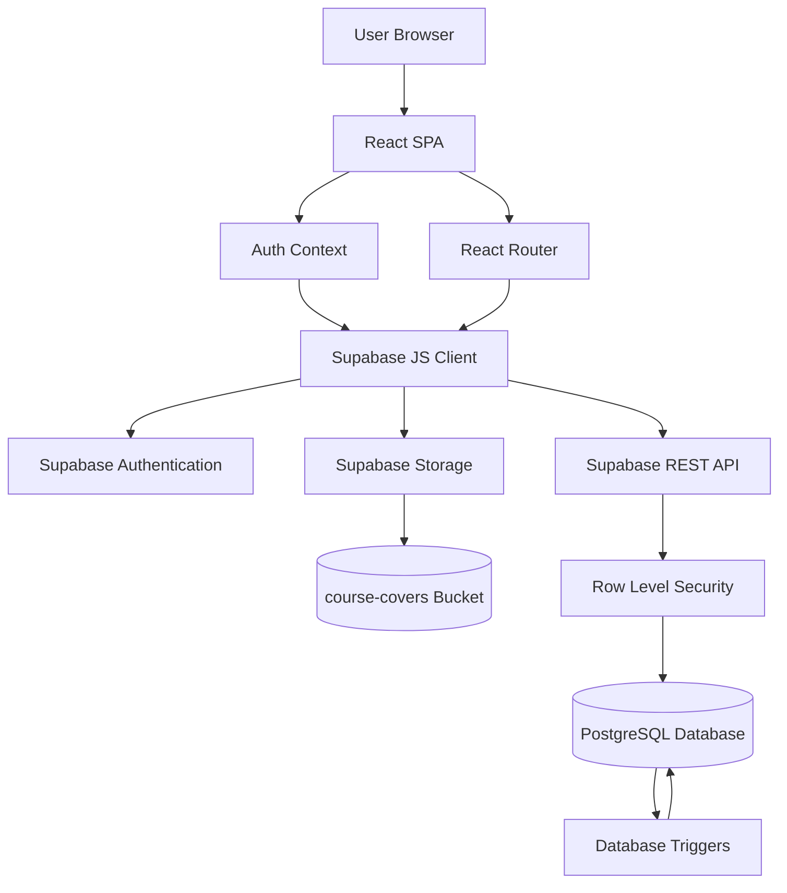
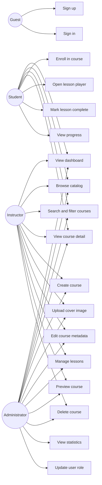
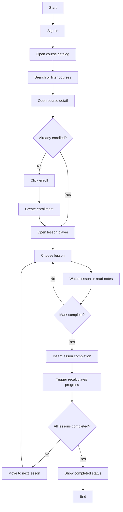
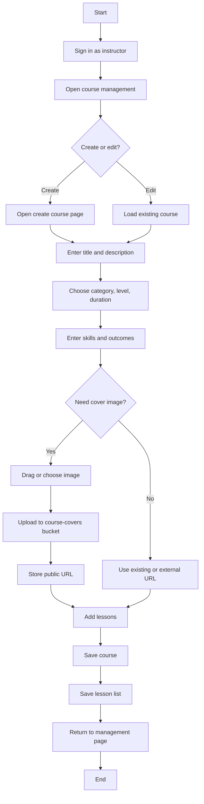
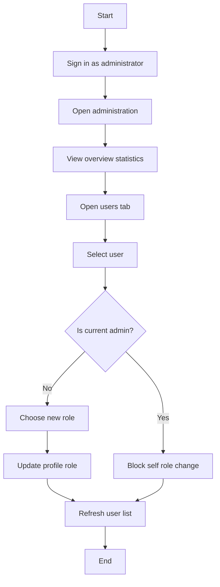
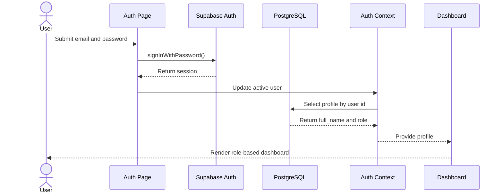
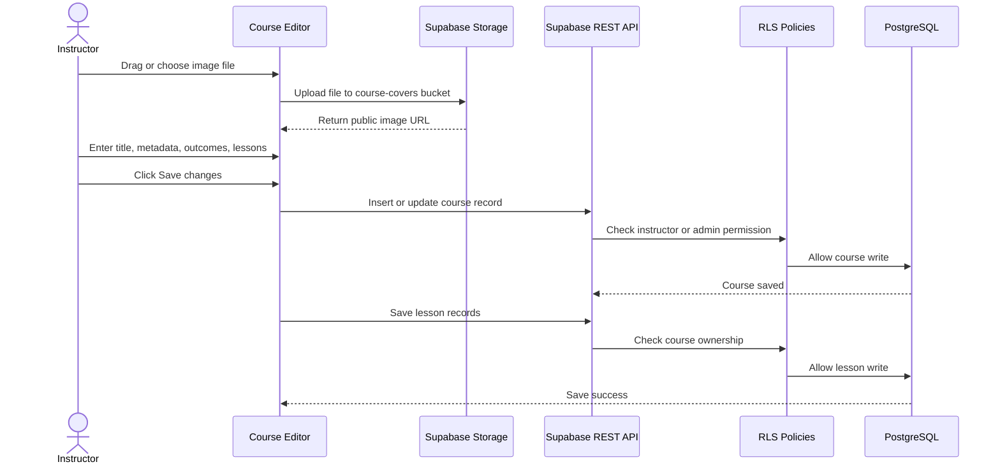
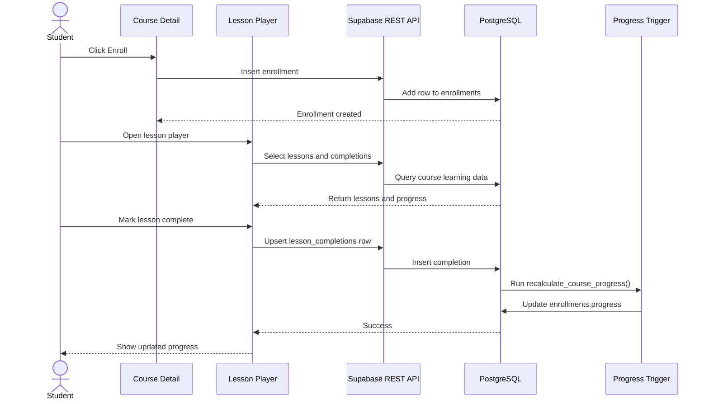
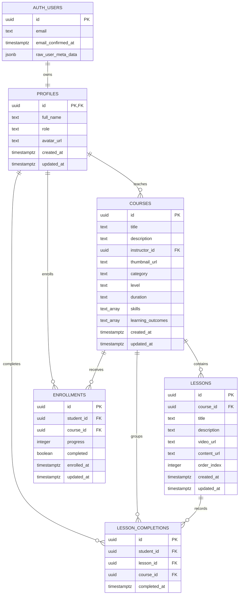

# MINI LEARNING MANAGEMENT SYSTEM

## Fundamental Project 2 Report

| Field | Information |
| --- | --- |
| Project name | Mini Learning Management System |
| Short name | MiniLMS |
| Project type | Web application with front-end and back-end |
| Main domain | Online learning management |
| Front-end | React, Vite, Tailwind CSS, React Router |
| Back-end service | Supabase Authentication, Supabase REST API, Supabase Storage |
| Database | PostgreSQL with Row Level Security |
| Main actors | Student, Instructor, Administrator |
| Report format | Markdown source for Word/PDF formatting |

## Abstract

Mini Learning Management System, called MiniLMS, is a small-scale web application designed to support online learning management in an academic context. The project focuses on the essential workflow of a learning platform: users authenticate, instructors create courses and lessons, students browse and enroll in courses, students learn through lesson content, and the system tracks learning progress. Administrators can monitor the whole system and manage user roles.

The project is implemented as a complete full-stack web application. The front-end is built with React, Vite, React Router, and Tailwind CSS. The back-end is implemented with Supabase, which provides Authentication, PostgreSQL database access, REST API, Row Level Security, and Storage for course cover images. The system uses a relational database design with the main tables `profiles`, `courses`, `lessons`, `enrollments`, and `lesson_completions`. In addition to the database tables, a Supabase Storage bucket named `course-covers` is used for uploaded course images.

The system supports three roles. Students can browse a catalog, search and filter courses, view course details, enroll, learn lessons, and mark lessons complete. Instructors can create, update, delete, and preview their own courses. Administrators can view system statistics and update user roles. The access control is enforced not only in the React interface but also at database level with PostgreSQL Row Level Security policies.

The final result is a working academic LMS prototype with real authentication, real database relationships, role-based access, file upload for course cover images, learning progress tracking, demo accounts, seed data, and a report with analysis, design diagrams, database explanation, implementation details, testing scenarios, and defense preparation questions.

## Table of Contents

1. Introduction
2. Chapter 1. Theoretical Basis and Tools
3. Chapter 2. System Analysis and Design
4. Chapter 3. Setup and Practical Results
5. Chapter 4. Conclusion and Future Work
6. References
7. Appendices

## Abbreviations

| Abbreviation | Meaning |
| --- | --- |
| LMS | Learning Management System |
| UI | User Interface |
| UX | User Experience |
| SPA | Single Page Application |
| API | Application Programming Interface |
| REST | Representational State Transfer |
| SQL | Structured Query Language |
| DBMS | Database Management System |
| RLS | Row Level Security |
| RBAC | Role-Based Access Control |
| CRUD | Create, Read, Update, Delete |
| UUID | Universally Unique Identifier |
| JWT | JSON Web Token |
| CDN | Content Delivery Network |

## List of Figures

| Figure | Figure name |
| --- | --- |
| Figure 2.1 | Overall system architecture |
| Figure 2.2 | Use case diagram |
| Figure 2.3 | Student learning activity diagram |
| Figure 2.4 | Instructor course authoring activity diagram |
| Figure 2.5 | Administrator role management activity diagram |
| Figure 2.6 | Authentication sequence diagram |
| Figure 2.7 | Course authoring and image upload sequence diagram |
| Figure 2.8 | Enrollment and progress tracking sequence diagram |
| Figure 2.9 | Database entity relationship diagram |
| Figure 3.1 | Sign in page screenshot placeholder |
| Figure 3.2 | Course catalog screenshot placeholder |
| Figure 3.3 | Course editor screenshot placeholder |
| Figure 3.4 | Course detail screenshot placeholder |
| Figure 3.5 | Lesson player screenshot placeholder |
| Figure 3.6 | Administration page screenshot placeholder |

## List of Tables

| Table | Table name |
| --- | --- |
| Table 1.1 | Technology stack |
| Table 2.1 | Actors and responsibilities |
| Table 2.2 | Functional requirements |
| Table 2.3 | Non-functional requirements |
| Table 2.4 | Use case summary |
| Table 2.5 | Database table summary |
| Table 2.6 | Row Level Security policy summary |
| Table 3.1 | Main routes |
| Table 3.2 | Demo accounts |
| Table 3.3 | Practical testing scenarios |
| Table 3.4 | Requirement completion mapping |

# Introduction

## 1. Overview

Online learning platforms are now common in universities, training centers, and self-study environments. A Learning Management System helps organize course content, manage users, and track learning activity. Even when the system is small, it must still handle important software engineering concerns: authentication, data design, role separation, content management, and progress tracking.

MiniLMS is a small LMS built for a fundamental software project. The goal is not to copy a large commercial system such as Coursera, Udemy, edX, or Moodle. Instead, the project extracts their core workflow and implements it in a compact way suitable for academic demonstration. A learner should be able to search for a course, understand what the course provides, enroll, learn lessons, and see progress. An instructor should be able to create a course, upload or provide a cover image, define course outcomes, add lessons, and preview the course. An administrator should be able to monitor the system and manage user roles.

The project is designed around clarity. Each major feature is connected to a database table, a user role, and a practical demonstration flow. This makes the system easier to defend academically because the implementation can be explained from requirement to interface, from interface to API, and from API to database security policy.

## 2. Problem Statement

A course management system must solve several practical problems:

- Learners need a clear catalog to find courses.
- Learners need course details before enrolling.
- Learners need a lesson player and progress feedback.
- Instructors need a way to create and update course content.
- Instructors need course images and metadata so the catalog looks realistic.
- Administrators need a way to monitor users and learning data.
- The system must prevent users from performing actions outside their roles.
- The database must keep learning progress consistent.

A simple interface alone is not enough. If the project only displays static course cards, it is not a complete web application. MiniLMS therefore includes a real Supabase database, authentication, Row Level Security, database triggers, and file upload through Supabase Storage. This makes the system more realistic and gives enough technical content for a defense.

## 3. Project Aims

The project aims to achieve the following objectives:

- Analyze and design a small but complete LMS.
- Implement a React single page application with protected routes.
- Integrate Supabase Authentication for sign up and sign in.
- Design a PostgreSQL database with relationships, constraints, and indexes.
- Apply Row Level Security for role-based data access.
- Implement course catalog with search and filters.
- Implement course metadata: category, level, duration, skills, and outcomes.
- Implement course cover image upload using Supabase Storage.
- Implement course and lesson management for instructors.
- Implement enrollment and lesson progress tracking for students.
- Implement an administration page for system statistics and role management.
- Prepare seed data and demo accounts for stable presentation.
- Prepare report documentation, UML-style diagrams, database explanation, and defense Q&A.

## 4. Scope of the Project

The project includes the following modules:

- Authentication module.
- Role-based route protection.
- Student dashboard.
- Instructor dashboard.
- Administrator dashboard.
- Course catalog with search and filtering.
- Course detail page with outcomes and skills.
- Course editor with image upload and curriculum management.
- Lesson player with lesson navigation and progress update.
- Admin panel with statistics and user role management.
- Database schema and RLS policies.
- Supabase Storage bucket for course cover images.
- Demo seed data and documentation.

The project does not include payment, certificate generation, quizzes, assignments, discussion forum, grading, or real-time chat. These are identified as future work.

## 5. Structure of the Report

The report is organized into four main chapters:

- Chapter 1 introduces the theoretical basis and tools used in the project.
- Chapter 2 presents system analysis and design, including requirements, use cases, activity diagrams, sequence diagrams, database design, and RLS policy design.
- Chapter 3 describes setup, implementation, practical results, testing, and demo preparation.
- Chapter 4 concludes the project and proposes future work.

# Chapter 1. Theoretical Basis and Tools

## 1.1 Learning Management System

A Learning Management System is a software platform that supports the creation, delivery, and tracking of learning activities. In a typical LMS, an instructor prepares learning materials, students access those materials, and administrators manage the system. Large LMS platforms may include complex features such as quizzes, assignments, grading, certificates, discussion, payments, and analytics.

For this project, the LMS is simplified to the most important elements:

- Course catalog.
- Course detail page.
- Course lessons.
- User enrollment.
- Lesson completion.
- Progress tracking.
- Course authoring.
- Administration.

This scope is appropriate for a fundamental project because it is complete enough to demonstrate full-stack development but not too large to explain clearly.

## 1.2 Client-Server Model

MiniLMS follows the client-server model. The client is the React application running in the user's browser. The server-side services are provided by Supabase. The browser does not directly modify the database without authentication and permission checks. Instead, it sends authenticated requests through Supabase APIs.

The client-server separation creates clear responsibilities:

- The client renders the interface and collects user input.
- Supabase Authentication verifies user identity.
- Supabase REST API provides database access.
- PostgreSQL stores data and enforces RLS policies.
- Supabase Storage stores uploaded course cover images.

## 1.3 Single Page Application

MiniLMS is a Single Page Application. The browser loads the application once and React Router changes views without reloading the whole page. This approach is suitable for dashboard applications because users frequently move between dashboard, catalog, course detail, editor, lesson player, and administration pages.

The SPA model improves user experience but also requires route protection. MiniLMS uses protected routes to redirect unauthorized users. However, the project does not rely only on frontend protection. The database still enforces the final access rules using RLS.

## 1.4 React

React is used to build the user interface. React supports component-based development, which helps organize pages and reusable elements. In MiniLMS, components such as `Layout`, `CourseCard`, and `ProtectedRoute` are reused across the application. Page-level components are placed in the `src/pages` directory.

React state is used for form values, loading states, errors, filters, current lesson selection, and upload progress. React effects are used to fetch data from Supabase when pages load or when route parameters change.

## 1.5 Vite

Vite is used as the development server and build tool. It provides fast local development and production build output. The project uses `npm run dev` for development, `npm run lint` for static checking, and `npm run build` for production build verification.

## 1.6 Tailwind CSS

Tailwind CSS is used for interface styling. It allows the project to build layouts, spacing, borders, colors, and responsive behavior directly in class names. For this project, Tailwind is used with a restrained visual style: simple white panels, neutral backgrounds, readable text, and small accent colors. The interface intentionally avoids heavy gradients and decorative elements so it looks more like a practical student-built academic system.

## 1.7 Supabase Authentication

Supabase Authentication manages user accounts and sessions. MiniLMS uses email and password login. When a new user signs up, a database trigger creates a row in the `profiles` table. The `profiles` table stores application-specific information such as full name and role.

The project also includes an auto-confirm trigger for academic demo stability. This prevents new signups from being blocked by an email confirmation step during the defense. Demo accounts are still the recommended way to present the system.

## 1.8 PostgreSQL and Relational Database

PostgreSQL is used as the relational database. The main benefit of a relational database is that it can represent structured relationships clearly. MiniLMS uses relationships such as:

- A profile can teach many courses.
- A course can contain many lessons.
- A student can enroll in many courses.
- A course can have many student enrollments.
- A student can complete many lessons.

Foreign keys, unique constraints, and indexes keep the data consistent. This is important because the project is not only a user interface; it also demonstrates proper database modeling.

## 1.9 Row Level Security

Row Level Security is a PostgreSQL feature that controls which rows a user can access. In MiniLMS, RLS is essential because the frontend uses Supabase client APIs. Without RLS, a user could manually call the API and try to access data outside their role.

MiniLMS applies RLS policies to all major tables. Examples include:

- Students can insert enrollments only for themselves.
- Students can insert lesson completion only for their own account and enrolled courses.
- Instructors can update only courses they own.
- Administrators can update user roles.

This design makes the authorization model stronger and easier to defend.

## 1.10 Supabase Storage

Supabase Storage is used for course cover images. In course creation and editing, an instructor can drag and drop an image or choose an image file from the computer. The file is uploaded to the `course-covers` bucket. The public URL of the uploaded image is stored in the `thumbnail_url` column of the `courses` table.

This feature improves the project because it demonstrates a real file upload workflow, not only text input. It also makes the course editor closer to course authoring tools seen in online learning platforms.

## 1.11 Technology Stack

Table 1.1 Technology stack

| Layer | Technology | Purpose |
| --- | --- | --- |
| Frontend framework | React | Build component-based user interface |
| Build tool | Vite | Local development and production build |
| Styling | Tailwind CSS | Responsive utility-based interface styling |
| Routing | React Router | Page routing and protected views |
| Icons | Lucide React | Simple functional icons |
| Backend platform | Supabase | Auth, REST API, Storage, database access |
| Database | PostgreSQL | Relational storage and SQL logic |
| Security | Row Level Security | Database-level authorization |
| File storage | Supabase Storage | Course cover image upload |
| Documentation diagrams | Mermaid | UML-style diagrams in Markdown |
| Version control | Git | Source code management |

# Chapter 2. System Analysis and Design

## 2.1 Actors and Responsibilities

Table 2.1 Actors and responsibilities

| Actor | Responsibility | Main permissions |
| --- | --- | --- |
| Guest | Access authentication page | Sign up, sign in |
| Student | Learn from courses | Browse catalog, filter/search courses, enroll, view lessons, mark lessons complete, view progress |
| Instructor | Manage course content | Create courses, upload cover images, edit metadata, add lessons, preview owned courses, delete owned courses |
| Administrator | Manage platform | View all statistics, view all courses, update user roles, manage platform data |

The actor model is intentionally simple. A clear role model helps the implementation remain understandable and defendable.

## 2.2 Functional Requirements

Table 2.2 Functional requirements

| ID | Requirement | Actor | Description |
| --- | --- | --- | --- |
| FR01 | Sign up | Guest | Register a new student or instructor account |
| FR02 | Sign in | Guest | Authenticate with email and password |
| FR03 | Load profile | Authenticated user | Load full name and role from `profiles` |
| FR04 | View dashboard | Authenticated user | See role-specific dashboard information |
| FR05 | Search course catalog | Student, Instructor, Admin | Search by title, description, instructor, category, level, and skills |
| FR06 | Filter courses | Student, Instructor, Admin | Filter courses by category and level |
| FR07 | View course detail | Authenticated user | View course description, metadata, skills, outcomes, and lessons |
| FR08 | Enroll in course | Student | Create enrollment record for current student |
| FR09 | Open lesson player | Student, course owner, Admin | Learn or preview course lessons |
| FR10 | Mark lesson complete | Student | Insert lesson completion and update progress |
| FR11 | Create course | Instructor, Admin | Create course with metadata and lessons |
| FR12 | Upload course cover | Instructor, Admin | Upload image to Supabase Storage and store public URL |
| FR13 | Edit course | Course owner, Admin | Update course metadata, cover image, and lessons |
| FR14 | Delete course | Course owner, Admin | Delete course and related data through cascade relationships |
| FR15 | View administration statistics | Admin | View users, courses, enrollments, and completion count |
| FR16 | Update user role | Admin | Change another user's role |

## 2.3 Non-Functional Requirements

Table 2.3 Non-functional requirements

| ID | Requirement | Description |
| --- | --- | --- |
| NFR01 | Usability | The interface must be clear, simple, and easy to demo |
| NFR02 | Security | Role and ownership rules must be enforced in the database |
| NFR03 | Data consistency | Progress must match actual lesson completion data |
| NFR04 | Maintainability | Code should be organized by components, pages, context, and schema |
| NFR05 | Responsiveness | Pages should work on desktop and smaller screens |
| NFR06 | Reliability | Demo accounts and seed data must allow stable presentation |
| NFR07 | Explainability | Each feature should be explainable through UI, API, and database design |
| NFR08 | File handling | Course image upload must validate file type and size |

## 2.4 Overall Architecture

Figure 2.1 Overall system architecture



The architecture has two important ideas. First, the frontend is responsible for user interaction but not final security. Second, PostgreSQL and Supabase enforce the backend rules. This means the project can be defended as a real full-stack application, not only a static React interface.

## 2.5 Use Case Diagram

Figure 2.2 Use case diagram



## 2.6 Use Case Summary

Table 2.4 Use case summary

| Use case | Actor | Precondition | Main flow | Result |
| --- | --- | --- | --- | --- |
| Sign in | Guest | Account exists | Enter email and password, Supabase verifies credentials, app loads profile | User enters dashboard |
| Browse catalog | Authenticated user | User is signed in | Open catalog, system loads courses, search and filter | Matching courses are displayed |
| Enroll in course | Student | Student is not enrolled | Click enroll, insert enrollment row | Student can start learning |
| Mark lesson complete | Student | Student is enrolled | Insert lesson completion, trigger updates progress | Progress increases |
| Create course | Instructor | Instructor is signed in | Enter metadata, upload image, add lessons, save | Course appears in catalog |
| Update user role | Admin | Admin is signed in | Select role for another user | User role changes |

## 2.7 Activity Diagrams

### 2.7.1 Student Learning Activity

Figure 2.3 Student learning activity diagram



### 2.7.2 Instructor Course Authoring Activity

Figure 2.4 Instructor course authoring activity diagram



### 2.7.3 Administrator Role Management Activity

Figure 2.5 Administrator role management activity diagram



## 2.8 Sequence Diagrams

### 2.8.1 Authentication Sequence

Figure 2.6 Authentication sequence diagram



### 2.8.2 Course Authoring and Image Upload Sequence

Figure 2.7 Course authoring and image upload sequence diagram



### 2.8.3 Enrollment and Progress Sequence

Figure 2.8 Enrollment and progress tracking sequence diagram



## 2.9 Database Design

MiniLMS uses five public application tables and one Supabase Storage bucket. The application tables are:

- `profiles`
- `courses`
- `lessons`
- `enrollments`
- `lesson_completions`

The storage bucket is:

- `course-covers`

Figure 2.9 Database entity relationship diagram



## 2.10 Database Table Summary

Table 2.5 Database table summary

| Table | Purpose | Important fields |
| --- | --- | --- |
| `profiles` | Stores application user information | `id`, `full_name`, `role`, `avatar_url` |
| `courses` | Stores course landing page data | `title`, `description`, `thumbnail_url`, `category`, `level`, `duration`, `skills`, `learning_outcomes`, `instructor_id` |
| `lessons` | Stores ordered lesson content | `course_id`, `title`, `description`, `video_url`, `order_index` |
| `enrollments` | Stores student-course relationship | `student_id`, `course_id`, `progress`, `completed` |
| `lesson_completions` | Stores completed lesson records | `student_id`, `lesson_id`, `course_id`, `completed_at` |
| `storage.objects` | Stores uploaded file metadata | `bucket_id`, `name`, `owner`, `metadata` |

## 2.11 Important Database Constraints

The database uses the following constraints:

- `profiles.id` references `auth.users.id`.
- `profiles.role` must be one of `admin`, `instructor`, or `student`.
- `courses.instructor_id` references `profiles.id`.
- `lessons.course_id` references `courses.id` with cascade delete.
- `enrollments.student_id` references `profiles.id` with cascade delete.
- `enrollments.course_id` references `courses.id` with cascade delete.
- `enrollments` has a unique constraint on `(student_id, course_id)`.
- `lesson_completions` has a unique constraint on `(student_id, lesson_id)`.
- `lessons` has a unique index on `(course_id, order_index)`.

These constraints prevent duplicate enrollments, duplicate completion records, invalid roles, and orphaned data.

## 2.12 Database Functions and Triggers

The project uses several PostgreSQL functions and triggers:

- `current_user_role()` returns the role of the authenticated user.
- `touch_updated_at()` updates timestamp fields before updates.
- `prevent_self_role_change()` prevents a user from changing their own role.
- `auto_confirm_auth_email()` confirms new signup emails for demo stability.
- `handle_new_user()` creates a profile after a new auth user is created.
- `recalculate_course_progress()` recalculates progress after lesson completions change.

The most important business logic trigger is `recalculate_course_progress()`. It counts the number of lessons in a course and the number of completed lessons for a student. The result is stored in `enrollments.progress`. This keeps progress consistent with detailed completion records.

## 2.13 Row Level Security Policy Design

Table 2.6 Row Level Security policy summary

| Table or bucket | Operation | Rule summary |
| --- | --- | --- |
| `profiles` | Select | Authenticated users can view profiles |
| `profiles` | Update | User can update own profile; admin can update profiles |
| `courses` | Select | Courses are viewable |
| `courses` | Insert | Instructor or admin can create courses |
| `courses` | Update | Course owner or admin can update courses |
| `courses` | Delete | Course owner or admin can delete courses |
| `lessons` | Select | Lessons are viewable |
| `lessons` | Insert | Course owner or admin can insert lessons |
| `lessons` | Update | Course owner or admin can update lessons |
| `lessons` | Delete | Course owner or admin can delete lessons |
| `enrollments` | Select | Student sees own enrollments; instructor sees owned course enrollments; admin sees all |
| `enrollments` | Insert | Student can enroll only themselves |
| `enrollments` | Update | Student can update only own progress |
| `lesson_completions` | Select | Student sees own completions; instructor sees owned course completions; admin sees all |
| `lesson_completions` | Insert | Student can insert own completion for enrolled course |
| `course-covers` | Select | Course cover images are publicly readable |
| `course-covers` | Insert | Instructor or admin can upload course images |
| `course-covers` | Update/Delete | Instructor or admin can manage uploaded course images |

## 2.14 Interface Design

The interface design is intentionally practical. The project avoids a large marketing hero, overly bright gradients, decorative logo effects, and icon-heavy dashboard cards. Instead, it uses:

- A simple login form.
- Top navigation for the main authenticated routes.
- Table and list layouts for dashboard, administration, and course management.
- Search and filter controls that actually affect the catalog.
- Course detail pages with metadata tables, outcomes, skills, and lesson outline.
- Course editor with category, level, duration, skills, outcomes, lessons, and image upload.
- Lesson player with a focused content area, progress tracking, previous/next navigation, and course outline.
- Neutral course image placeholder when no uploaded cover image exists.

The interface is influenced by common online course platform patterns: course catalog, course metadata, learning outcomes, course image, lesson list, and progress. Moodle's course overview model supports list, summary, and card-style course displays, so MiniLMS uses compact lists and tables where users need to scan information. Udemy's course landing page guidance emphasizes title, description, level, category, learning objectives, curriculum, and course image, so these fields are included in the course editor and course detail page. However, the visual style remains smaller and more academic so the project feels like an internal student-built LMS rather than a generated marketing page.

# Chapter 3. Setup and Practical Results

## 3.1 Project Structure

```text
Mini_Learning_Management_System/
  docs/
    MiniLMS_Report.md
    Defense_Guide_vi.md
  public/
    favicon.svg
  src/
    components/
      CourseCard.jsx
      CourseCover.jsx
      Layout.jsx
      ProtectedRoute.jsx
    context/
      AuthContext.jsx
    lib/
      supabaseClient.js
    pages/
      AdminPanel.jsx
      Auth.jsx
      CourseDetail.jsx
      CourseEditor.jsx
      CourseList.jsx
      Dashboard.jsx
      LessonView.jsx
      ManageCourses.jsx
    App.jsx
    index.css
    main.jsx
  supabase/
    schema.sql
  seed.js
  README.md
  package.json
```

## 3.2 Environment Setup

The project uses environment variables stored in `.env.local`. The required variables are:

```env
VITE_SUPABASE_URL=your_supabase_url
VITE_SUPABASE_ANON_KEY=your_anon_key
SUPABASE_SERVICE_ROLE_KEY=your_service_role_key
DATABASE_PASSWORD=your_database_password
```

The `.env.local` file is not committed to the repository. The `.env.example` file documents which values are required.

## 3.3 Install and Run

Install dependencies:

```bash
npm ci
```

Run development server:

```bash
npm run dev
```

Run lint:

```bash
npm run lint
```

Run production build:

```bash
npm run build
```

Seed demo data:

```bash
node seed.js
```

## 3.4 Main Routes

Table 3.1 Main routes

| Route | Page | Access |
| --- | --- | --- |
| `/auth` | Authentication page | Public |
| `/` | Dashboard | Authenticated users |
| `/courses` | Course catalog | Authenticated users |
| `/courses/:id` | Course detail | Authenticated users |
| `/learn/:courseId` | Lesson player | Enrolled student, course owner, or admin |
| `/manage-courses` | Course management | Instructor or admin |
| `/manage-courses/new` | Create course | Instructor or admin |
| `/manage-courses/edit/:id` | Edit course | Course owner or admin |
| `/admin` | Administration panel | Admin only |

## 3.5 Demo Accounts

Table 3.2 Demo accounts

| Role | Email | Password |
| --- | --- | --- |
| Administrator | `admin@example.com` | `password123` |
| Instructor | `instructor@example.com` | `password123` |
| Student | `student@example.com` | `password123` |

## 3.6 Authentication Result

The authentication page supports sign in and sign up. The page is intentionally simple. It shows demo accounts for quick testing and avoids a large decorative hero panel. After sign in, the app loads the user's profile and redirects to the dashboard.

Figure 3.1 Sign in page screenshot placeholder

Insert screenshot here after formatting in Word.

## 3.7 Course Catalog Result

The catalog page displays course cards with image, category, instructor, title, description, level, duration, skills, lesson count, and a link to detail. The search input matches title, description, instructor, category, level, and skills. The category and level filters allow users to narrow course results.

Figure 3.2 Course catalog screenshot placeholder

Insert screenshot here after formatting in Word.

## 3.8 Course Editor Result

The course editor is one of the strongest practical features. It allows instructors to enter:

- Course title.
- Description.
- Category.
- Level.
- Duration.
- Skills.
- Learning outcomes.
- Cover image by drag-and-drop or file picker.
- External cover image URL if needed.
- Lesson titles.
- Lesson video URLs.
- Lesson notes.

The image upload workflow stores files in Supabase Storage. The public URL is saved to `courses.thumbnail_url`.

Figure 3.3 Course editor screenshot placeholder

Insert screenshot here after formatting in Word.

## 3.9 Course Detail Result

The course detail page displays course metadata and learning value clearly. It shows category, level, duration, instructor, updated date, skills, learning outcomes, course image, enrollment action, and lesson list. This helps the student understand the course before enrolling.

Figure 3.4 Course detail screenshot placeholder

Insert screenshot here after formatting in Word.

## 3.10 Lesson Player Result

The lesson player shows video content, current lesson title, progress bar, previous/next navigation, mark complete action, and a course outline panel. For instructors and admins, the player runs in preview mode. For students, completion updates are saved to the database.

Figure 3.5 Lesson player screenshot placeholder

Insert screenshot here after formatting in Word.

## 3.11 Administration Result

The administration page shows system statistics and user role management. It displays total users, total courses, total enrollments, completed enrollments, user distribution, and learning statistics. The admin can update another user's role, but self role change is blocked.

Figure 3.6 Administration page screenshot placeholder

Insert screenshot here after formatting in Word.

## 3.12 Practical Testing Scenarios

Table 3.3 Practical testing scenarios

| ID | Scenario | Steps | Expected result | Status |
| --- | --- | --- | --- | --- |
| T01 | Admin login | Sign in as admin | Admin dashboard and Administration menu appear | Passed |
| T02 | Instructor login | Sign in as instructor | Course Management menu appears | Passed |
| T03 | Student login | Sign in as student | Student dashboard and enrolled courses appear | Passed |
| T04 | Search courses | Search keyword in catalog | Matching courses are displayed | Passed |
| T05 | Filter courses | Select category or level | Catalog results update | Passed |
| T06 | Upload cover image | Drag or choose an image in Course Editor | Image uploads and preview appears | Passed |
| T07 | Create course | Enter metadata, image, lessons, save | Course appears in management page | Passed |
| T08 | View course detail | Open course detail | Metadata, skills, outcomes, lessons appear | Passed |
| T09 | Enroll | Student clicks Enroll | Enrollment row is created | Passed |
| T10 | Complete lesson | Student marks lesson complete | Progress increases | Passed |
| T11 | Admin role update | Admin changes another user's role | Role updates in profile table | Passed |
| T12 | Unauthorized admin access | Student opens admin route | Student is redirected | Passed |

## 3.13 Requirement Completion Mapping

Table 3.4 Requirement completion mapping

| Requirement | Implementation result |
| --- | --- |
| Authentication | Supabase Auth with sign in, sign up, sign out |
| Profile and role | `profiles` table and automatic profile creation trigger |
| Course catalog | CourseList page with search and filters |
| Course metadata | Category, level, duration, skills, learning outcomes fields |
| Image upload | Supabase Storage bucket `course-covers` and CourseEditor upload UI |
| Course detail | CourseDetail page with outcomes, skills, metadata, lesson list |
| Course management | ManageCourses and CourseEditor pages |
| Lessons | `lessons` table and curriculum editor |
| Enrollment | `enrollments` table and enroll action |
| Progress tracking | `lesson_completions` table and progress trigger |
| Admin statistics | AdminPanel overview and users tab |
| Role security | Protected routes and Row Level Security policies |
| Demo readiness | Seed script creates accounts, courses, lessons, enrollments |

## 3.14 Verification Commands

The project was verified with:

```bash
npm run lint
npm run build
node seed.js
```

The production build completed successfully. Vite may show a bundle size warning because the app imports front-end dependencies in one bundle, but this warning does not prevent the application from running.

# Chapter 4. Conclusion and Future Work

## 4.1 Conclusion

MiniLMS successfully implements a complete small-scale Learning Management System. The project includes authentication, role-based access, course catalog, course management, course cover image upload, lesson management, enrollment, lesson player, progress tracking, and administration. The system uses a real PostgreSQL database with foreign keys, unique constraints, indexes, triggers, and Row Level Security policies.

The main technical strengths of the project are:

- Clear three-role model: student, instructor, administrator.
- Database-level security using RLS.
- Learning progress calculated from detailed completion records.
- Course editor with real image upload through Supabase Storage.
- Course metadata that makes the catalog and detail page more realistic.
- Stable demo accounts and seed data.
- Documentation with analysis, UML-style diagrams, ERD, and testing scenarios.

The project meets the academic requirement of a complete web application with both front-end and back-end. It is also structured so each feature can be explained scientifically during defense.

## 4.2 Limitations

The current version has several limitations:

- No quiz module.
- No assignment submission.
- No grading workflow.
- No certificate generation.
- No discussion or comments.
- No payment or pricing.
- No advanced analytics.
- No drag-and-drop lesson ordering.
- Course editing replaces lesson records instead of performing advanced lesson synchronization.

These limitations are acceptable for the project scope because MiniLMS focuses on LMS foundation features.

## 4.3 Future Work

Future improvements may include:

- Quiz and question bank module.
- Assignment upload and grading.
- Certificate generation after course completion.
- Discussion board for each course.
- Course categories with admin management.
- Lesson duration and total course time calculation.
- Drag-and-drop lesson ordering.
- Instructor analytics dashboard.
- Notification system.
- File attachments for lessons.
- Automated unit and integration tests.

# References

1. React Documentation. https://react.dev/
2. Vite Documentation. https://vite.dev/
3. React Router Documentation. https://reactrouter.com/
4. Tailwind CSS Documentation. https://tailwindcss.com/
5. Supabase Documentation. https://supabase.com/docs
6. Supabase Authentication Documentation. https://supabase.com/docs/guides/auth
7. Supabase Storage Documentation. https://supabase.com/docs/guides/storage
8. Supabase Row Level Security Documentation. https://supabase.com/docs/guides/database/postgres/row-level-security
9. PostgreSQL Documentation. https://www.postgresql.org/docs/
10. Mermaid Documentation. https://mermaid.js.org/
11. Udemy Teaching Center: Create your course landing page. https://teach.udemy.com/publishing/create-your-course-landing-page/
12. Udemy Support: Course Image Quality Standards. https://support.udemy.com/hc/en-us/articles/229232347-Course-Image-Quality-Standards
13. Moodle Docs: Course overview. https://docs.moodle.org/310/en/Course_overview

# Appendix A. Defense Questions and Suggested Answers

## A.1 Why did you choose MiniLMS?

MiniLMS is suitable because it combines many important software engineering topics: authentication, role-based access, relational database design, CRUD operations, file upload, and progress tracking. It is small enough for a student project but complete enough to demonstrate a real full-stack workflow.

## A.2 Why did you use Supabase?

Supabase provides Authentication, PostgreSQL, REST API, Storage, and Row Level Security. The project still requires backend design because I designed the database schema, relationships, constraints, triggers, RLS policies, and storage bucket policies. Supabase reduces infrastructure work but does not remove the need for system design.

## A.3 Is frontend route protection enough?

No. Frontend route protection improves user experience, but it is not the final security layer. A user can still try to call an API manually. The real protection is Row Level Security in PostgreSQL, where each database operation is checked by user identity and role.

## A.4 How is course progress calculated?

The system stores each completed lesson in `lesson_completions`. When a completion record is inserted or deleted, a database trigger counts total lessons and completed lessons, then updates `enrollments.progress`. This keeps progress consistent with detailed learning history.

## A.5 Why do you need `lesson_completions`?

If the system stored only a percentage, it would not know which lessons were completed. `lesson_completions` stores detailed evidence. From this table, the system can display check marks, recalculate progress, and support future analytics.

## A.6 How does image upload work?

In Course Editor, the instructor drags an image or chooses a file. The frontend validates file type and size, uploads the file to the Supabase Storage bucket `course-covers`, receives a public URL, and stores that URL in the `courses.thumbnail_url` column.

## A.7 Can an instructor edit another instructor's course?

No. The RLS policy checks ownership using `instructor_id = auth.uid()`. Instructors can manage only their own courses. Admins have broader permission because they manage the whole system.

## A.8 What happens if a course is deleted?

Related lessons, enrollments, and lesson completion records are deleted through foreign key cascade relationships. This prevents orphaned data.

## A.9 What is the strongest part of the project?

The strongest part is that the system combines a working user interface with real database security and real learning logic. The project has role-based flows, RLS policies, progress triggers, and file upload, so it can be explained from both user and technical perspectives.

## A.10 What would you improve next?

The next improvements would be quiz, assignment, certificate, discussion, lesson attachment, drag-and-drop lesson ordering, and more advanced analytics.

# Appendix B. Suggested Demo Script

1. Sign in as administrator.
2. Open dashboard and show system statistics.
3. Open Administration and explain user roles.
4. Sign out and sign in as instructor.
5. Open Course Management.
6. Create or edit a course.
7. Upload a course cover image by choosing a file or dragging an image.
8. Edit category, level, duration, skills, outcomes, and lessons.
9. Save and preview the course.
10. Sign out and sign in as student.
11. Open Course Catalog.
12. Search and filter courses.
13. Open Course Detail and explain metadata, skills, outcomes, and lesson list.
14. Enroll in a course.
15. Open Lesson Player and mark a lesson complete.
16. Show progress update.
17. Open Supabase and explain tables, RLS, trigger, and storage bucket.

# Appendix C. Database Explanation for Defense

The database has five main public tables. `profiles` stores user role and display name. `courses` stores course metadata, image URL, skills, and outcomes. `lessons` stores ordered lesson content. `enrollments` stores the relationship between student and course, including progress. `lesson_completions` stores detailed lesson completion records.

The course cover image itself is stored in Supabase Storage. The database stores only the public URL. This keeps the database focused on structured data and lets Storage handle file content.

The project uses RLS policies to protect data. For example, a student can insert only their own enrollment, and an instructor can update only courses they own. This means the security model does not depend only on hiding buttons in the interface.
