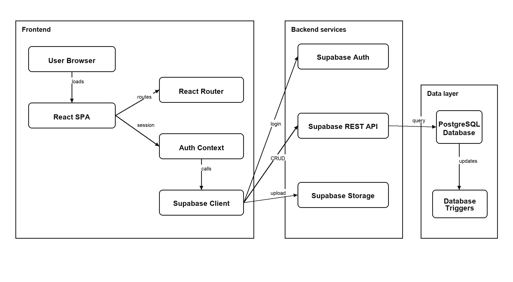
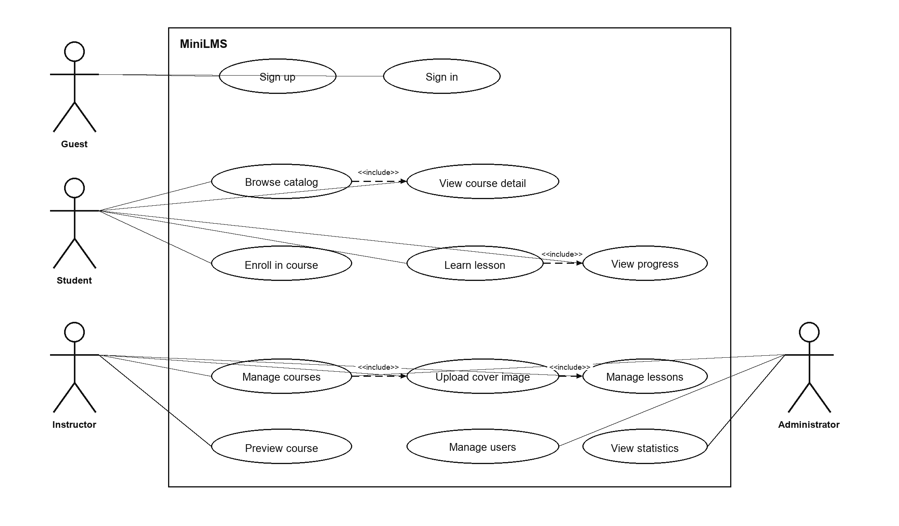
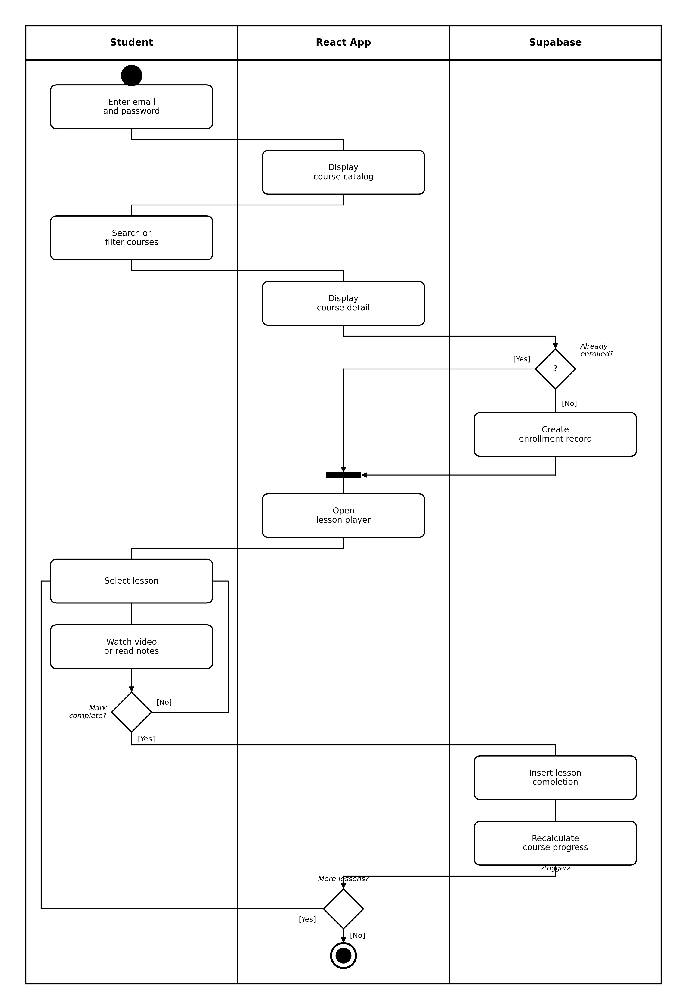
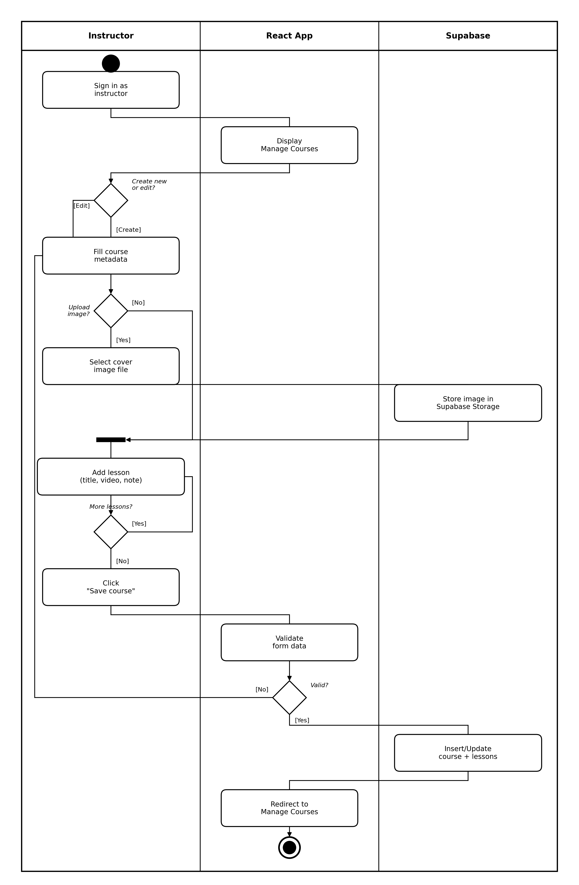
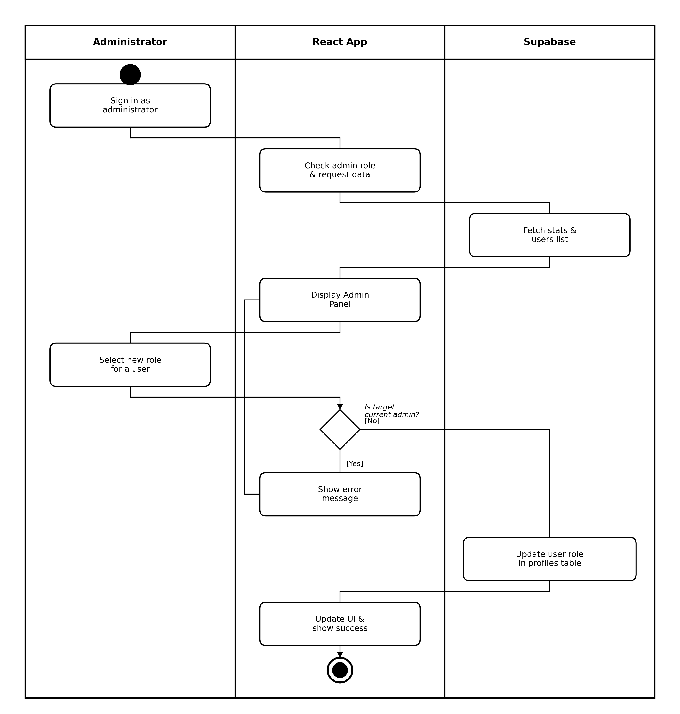
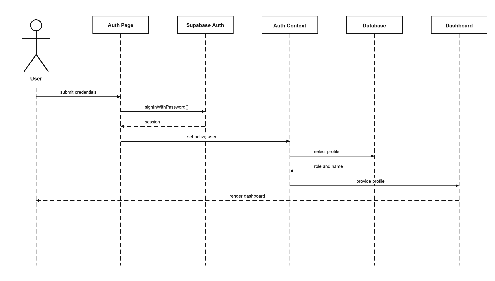
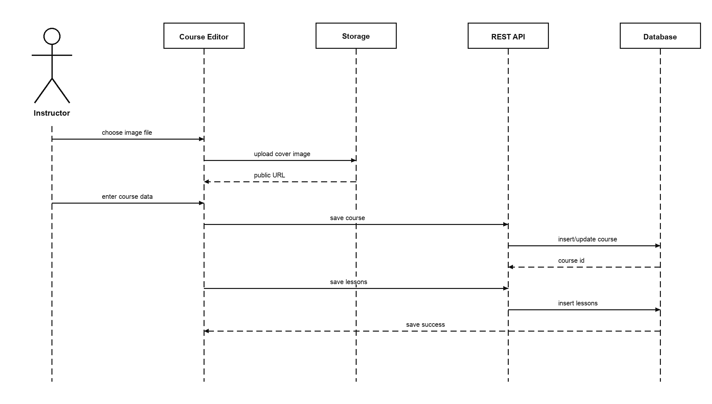
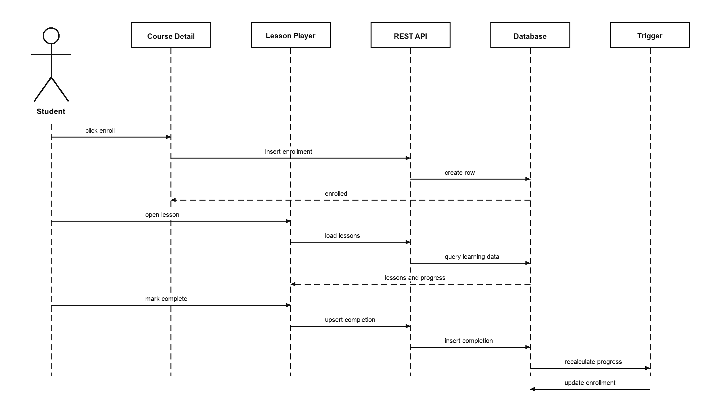
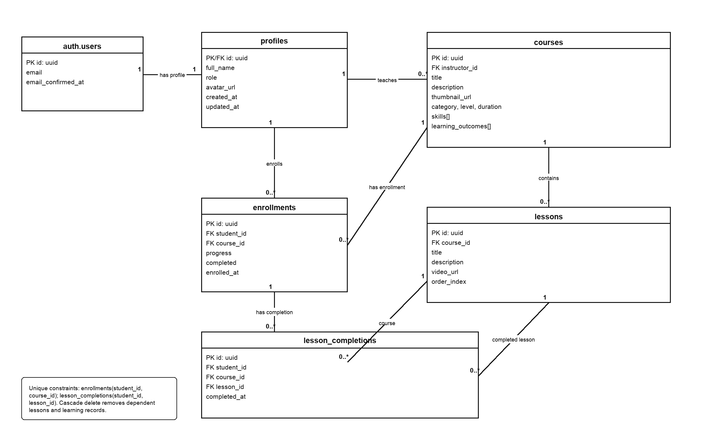

# MINI LEARNING MANAGEMENT SYSTEM

## Fundamental Project 2 Report

| Field | Information |
| --- | --- |
| Project name | Mini Learning Management System |
| Short name | MiniLMS |
| Project type | Web application with front-end and back-end |
| Main domain | Online learning management |
| Front-end | React, Vite, Tailwind CSS, React Router |
| Back-end service | Supabase Authentication, Supabase REST API, Supabase Storage |
| Database | PostgreSQL with role-based access control |
| Main actors | Student, Instructor, Administrator |
| Report format | Markdown source for Word/PDF formatting |

## Abstract

Mini Learning Management System, called MiniLMS, is a small-scale web application designed to support online learning management in an academic context. The project focuses on the essential workflow of a learning platform: users authenticate, instructors create courses and lessons, students browse and enroll in courses, students learn through lesson content, and the system tracks learning progress. Administrators can monitor the whole system and manage user roles.

The project is implemented as a complete full-stack web application. The front-end is built with React, Vite, React Router, and Tailwind CSS. The back-end is implemented with Supabase, which provides Authentication, PostgreSQL database access, REST API, database access policies, and Storage for course cover images. The system uses a relational database design with the main tables `profiles`, `courses`, `lessons`, `enrollments`, and `lesson_completions`. In addition to the database tables, a Supabase Storage bucket named `course-covers` is used for uploaded course images.

The system supports three roles. Students can browse a catalog, search and filter courses, view course details, enroll, learn lessons, and mark lessons complete. Instructors can create, update, delete, and preview their own courses. Administrators can view system statistics and update user roles. Access control is enforced not only in the React interface but also through database-level access policies.

The final result is a working academic LMS prototype with real authentication, real database relationships, role-based access, file upload for course cover images, learning progress tracking, demo accounts, seed data, and a report with analysis, design diagrams, database explanation, implementation details, testing scenarios, and defense preparation questions.

## Table of Contents

1. Introduction
2. Chapter 1. Theoretical Basis and Tools
3. Chapter 2. System Analysis and Design
4. Chapter 3. Setup and Practical Results
5. Chapter 4. Conclusion and Future Work
6. References
7. Appendices

## Abbreviations

| Abbreviation | Meaning |
| --- | --- |
| LMS | Learning Management System |
| UI | User Interface |
| UX | User Experience |
| SPA | Single Page Application |
| API | Application Programming Interface |
| REST | Representational State Transfer |
| SQL | Structured Query Language |
| DBMS | Database Management System |
| RBAC | Role-Based Access Control |
| CRUD | Create, Read, Update, Delete |
| UUID | Universally Unique Identifier |
| JWT | JSON Web Token |
| CDN | Content Delivery Network |

## List of Figures

| Figure | Figure name |
| --- | --- |
| Figure 2.1 | Overall system architecture |
| Figure 2.2 | Use case diagram |
| Figure 2.3 | Student learning activity diagram |
| Figure 2.4 | Instructor course authoring activity diagram |
| Figure 2.5 | Administrator role management activity diagram |
| Figure 2.6 | Authentication sequence diagram |
| Figure 2.7 | Course authoring and image upload sequence diagram |
| Figure 2.8 | Enrollment and progress tracking sequence diagram |
| Figure 2.9 | Database entity relationship diagram |
| Figure 3.1 | Sign in page screenshot placeholder |
| Figure 3.2 | Course catalog screenshot placeholder |
| Figure 3.3 | Course editor screenshot placeholder |
| Figure 3.4 | Course detail screenshot placeholder |
| Figure 3.5 | Lesson player screenshot placeholder |
| Figure 3.6 | Administration page screenshot placeholder |

## List of Tables

| Table | Table name |
| --- | --- |
| Table 1.1 | Technology stack |
| Table 2.1 | Actors and responsibilities |
| Table 2.2 | Functional requirements |
| Table 2.3 | Non-functional requirements |
| Table 2.4 | Use case summary |
| Table 2.5 | Database table summary |
| Table 2.6 | Database access policy summary |
| Table 3.1 | Development tools |
| Table 3.2 | Database preparation results |
| Table 3.3 | Seed data summary |
| Table 3.4 | Demo accounts |
| Table 3.5 | Main routes |
| Table 3.6 | Implementation result by module |
| Table 3.7 | Practical testing checklist |
| Table 3.8 | Requirement completion mapping |

# Introduction

## 1. Overview

Online learning platforms are now common in universities, training centers, and self-study environments. A Learning Management System helps organize course content, manage users, and track learning activity. Even when the system is small, it must still handle important software engineering concerns: authentication, data design, role separation, content management, and progress tracking.

MiniLMS is a small LMS built for a fundamental software project. The goal is not to copy a large commercial system such as Coursera, Udemy, edX, or Moodle. Instead, the project extracts their core workflow and implements it in a compact way suitable for academic demonstration. A learner should be able to search for a course, understand what the course provides, enroll, learn lessons, and see progress. An instructor should be able to create a course, upload or provide a cover image, define course outcomes, add lessons, and preview the course. An administrator should be able to monitor the system and manage user roles.

The project is designed around clarity. Each major feature is connected to a database table, a user role, and a practical demonstration flow. This makes the system easier to defend academically because the implementation can be explained from requirement to interface, from interface to API, and from API to database security policy.

## 2. Problem Statement

A course management system must solve several practical problems:

- Learners need a clear catalog to find courses.
- Learners need course details before enrolling.
- Learners need a lesson player and progress feedback.
- Instructors need a way to create and update course content.
- Instructors need course images and metadata so the catalog looks realistic.
- Administrators need a way to monitor users and learning data.
- The system must prevent users from performing actions outside their roles.
- The database must keep learning progress consistent.

A simple interface alone is not enough. If the project only displays static course cards, it is not a complete web application. MiniLMS therefore includes a real Supabase database, authentication, database access policies, database triggers, and file upload through Supabase Storage. This makes the system more realistic and gives enough technical content for a defense.

## 3. Project Aims

The project aims to achieve the following objectives:

- Analyze and design a small but complete LMS.
- Implement a React single page application with protected routes.
- Integrate Supabase Authentication for sign up and sign in.
- Design a PostgreSQL database with relationships, constraints, and indexes.
- Apply database access policies for role-based data access.
- Implement course catalog with search and filters.
- Implement course metadata: category, level, duration, skills, and outcomes.
- Implement course cover image upload using Supabase Storage.
- Implement course and lesson management for instructors.
- Implement enrollment and lesson progress tracking for students.
- Implement an administration page for system statistics and role management.
- Prepare seed data and demo accounts for stable presentation.
- Prepare report documentation, UML-style diagrams, database explanation, and defense Q&A.

## 4. Scope of the Project

The project includes the following modules:

- Authentication module.
- Role-based route protection.
- Student dashboard.
- Instructor dashboard.
- Administrator dashboard.
- Course catalog with search and filtering.
- Course detail page with outcomes and skills.
- Course editor with image upload and curriculum management.
- Lesson player with lesson navigation and progress update.
- Admin panel with statistics and user role management.
- Database schema and access policies.
- Supabase Storage bucket for course cover images.
- Demo seed data and documentation.

The project does not include payment, certificate generation, quizzes, assignments, discussion forum, grading, or real-time chat. These are identified as future work.

## 5. Structure of the Report

The report is organized into four main chapters:

- Chapter 1 introduces the theoretical basis and tools used in the project.
- Chapter 2 presents system analysis and design, including requirements, use cases, activity diagrams, sequence diagrams, database design, and database access policy design.
- Chapter 3 describes setup, implementation, practical results, testing, and demo preparation.
- Chapter 4 concludes the project and proposes future work.

# Chapter 1. Theoretical Basis and Tools

## 1.1 Learning Management System

A Learning Management System is a software platform that supports the creation, delivery, and tracking of learning activities. In a typical LMS, an instructor prepares learning materials, students access those materials, and administrators manage the system. Large LMS platforms may include complex features such as quizzes, assignments, grading, certificates, discussion, payments, and analytics.

For this project, the LMS is simplified to the most important elements:

- Course catalog.
- Course detail page.
- Course lessons.
- User enrollment.
- Lesson completion.
- Progress tracking.
- Course authoring.
- Administration.

This scope is appropriate for a fundamental project because it is complete enough to demonstrate full-stack development but not too large to explain clearly.

## 1.2 Client-Server Model

MiniLMS follows the client-server model. The client is the React application running in the user's browser. The server-side services are provided by Supabase. The browser does not directly modify the database without authentication and permission checks. Instead, it sends authenticated requests through Supabase APIs.

The client-server separation creates clear responsibilities:

- The client renders the interface and collects user input.
- Supabase Authentication verifies user identity.
- Supabase REST API provides database access.
- PostgreSQL stores data and enforces database access rules.
- Supabase Storage stores uploaded course cover images.

## 1.3 Single Page Application

MiniLMS is a Single Page Application. The browser loads the application once and React Router changes views without reloading the whole page. This approach is suitable for dashboard applications because users frequently move between dashboard, catalog, course detail, editor, lesson player, and administration pages.

The SPA model improves user experience but also requires route protection. MiniLMS uses protected routes to redirect unauthorized users. However, the project does not rely only on frontend protection. The database still enforces final access rules for important operations.

## 1.4 React

React is used to build the user interface. React supports component-based development, which helps organize pages and reusable elements. In MiniLMS, components such as `Layout`, `CourseCard`, and `ProtectedRoute` are reused across the application. Page-level components are placed in the `src/pages` directory.

React state is used for form values, loading states, errors, filters, current lesson selection, and upload progress. React effects are used to fetch data from Supabase when pages load or when route parameters change.

## 1.5 Vite

Vite is used as the development server and build tool. It provides fast local development and production build output. The project uses `npm run dev` for development, `npm run lint` for static checking, and `npm run build` for production build verification.

## 1.6 Tailwind CSS

Tailwind CSS is used for interface styling. It allows the project to build layouts, spacing, borders, colors, and responsive behavior directly in class names. For this project, Tailwind is used with a restrained visual style: simple white panels, neutral backgrounds, readable text, and small accent colors. The interface intentionally avoids heavy gradients and decorative elements so it looks more like a practical student-built academic system.

## 1.7 Supabase Authentication

Supabase Authentication manages user accounts and sessions. MiniLMS uses email and password login. When a new user signs up, a database trigger creates a row in the `profiles` table. The `profiles` table stores application-specific information such as full name and role.

The project also includes an auto-confirm trigger for academic demo stability. This prevents new signups from being blocked by an email confirmation step during the defense. Demo accounts are still the recommended way to present the system.

## 1.8 PostgreSQL and Relational Database

PostgreSQL is used as the relational database. The main benefit of a relational database is that it can represent structured relationships clearly. MiniLMS uses relationships such as:

- A profile can teach many courses.
- A course can contain many lessons.
- A student can enroll in many courses.
- A course can have many student enrollments.
- A student can complete many lessons.

Foreign keys, unique constraints, and indexes keep the data consistent. This is important because the project is not only a user interface; it also demonstrates proper database modeling.

## 1.9 Database Access Control

Database access control defines which authenticated user can read or modify each group of data. In MiniLMS, this is important because the frontend calls Supabase APIs directly. Without database-level checks, a user could try to call the API outside the intended interface.

MiniLMS applies role-based database policies to all major tables. Examples include:

- Students can insert enrollments only for themselves.
- Students can insert lesson completion only for their own account and enrolled courses.
- Instructors can update only courses they own.
- Administrators can update user roles.

This design makes the authorization model stronger and easier to defend.

## 1.10 Supabase Storage

Supabase Storage is used for course cover images. In course creation and editing, an instructor can drag and drop an image or choose an image file from the computer. The file is uploaded to the `course-covers` bucket. The public URL of the uploaded image is stored in the `thumbnail_url` column of the `courses` table.

This feature improves the project because it demonstrates a real file upload workflow, not only text input. It also makes the course editor closer to course authoring tools seen in online learning platforms.

## 1.11 Technology Stack

Table 1.1 Technology stack

| Layer | Technology | Purpose |
| --- | --- | --- |
| Frontend framework | React | Build component-based user interface |
| Build tool | Vite | Local development and production build |
| Styling | Tailwind CSS | Responsive utility-based interface styling |
| Routing | React Router | Page routing and protected views |
| Backend platform | Supabase | Auth, REST API, Storage, database access |
| Database | PostgreSQL | Relational storage and SQL logic |
| Security | Database access policies | Database-level authorization |
| File storage | Supabase Storage | Course cover image upload |
| Documentation diagrams | Mermaid | UML-style diagrams in Markdown |
| Version control | Git | Source code management |

# Chapter 2. System Analysis and Design

## 2.1 Actors and Responsibilities

Table 2.1 Actors and responsibilities

| Actor | Responsibility | Main permissions |
| --- | --- | --- |
| Guest | Access authentication page | Sign up, sign in |
| Student | Learn from courses | Browse catalog, filter/search courses, enroll, view lessons, mark lessons complete, view progress |
| Instructor | Manage course content | Create courses, upload cover images, edit metadata, add lessons, preview owned courses, delete owned courses |
| Administrator | Manage platform | View all statistics, view all courses, update user roles, manage platform data |

The actor model is intentionally simple. A clear role model helps the implementation remain understandable and defendable.

## 2.2 Functional Requirements

Table 2.2 Functional requirements

| ID | Requirement | Actor | Description |
| --- | --- | --- | --- |
| FR01 | Sign up | Guest | Register a new student or instructor account |
| FR02 | Sign in | Guest | Authenticate with email and password |
| FR03 | Load profile | Authenticated user | Load full name and role from `profiles` |
| FR04 | View dashboard | Authenticated user | See role-specific dashboard information |
| FR05 | Search course catalog | Student, Instructor, Admin | Search by title, description, instructor, category, level, and skills |
| FR06 | Filter courses | Student, Instructor, Admin | Filter courses by category and level |
| FR07 | View course detail | Authenticated user | View course description, metadata, skills, outcomes, and lessons |
| FR08 | Enroll in course | Student | Create enrollment record for current student |
| FR09 | Open lesson player | Student, course owner, Admin | Learn or preview course lessons |
| FR10 | Mark lesson complete | Student | Insert lesson completion and update progress |
| FR11 | Create course | Instructor, Admin | Create course with metadata and lessons |
| FR12 | Upload course cover | Instructor, Admin | Upload image to Supabase Storage and store public URL |
| FR13 | Edit course | Course owner, Admin | Update course metadata, cover image, and lessons |
| FR14 | Delete course | Course owner, Admin | Delete course and related data through cascade relationships |
| FR15 | View administration statistics | Admin | View users, courses, enrollments, and completion count |
| FR16 | Update user role | Admin | Change another user's role |

## 2.3 Non-Functional Requirements

Table 2.3 Non-functional requirements

| ID | Requirement | Description |
| --- | --- | --- |
| NFR01 | Usability | The interface must be clear, simple, and easy to demo |
| NFR02 | Security | Role and ownership rules must be enforced in the database |
| NFR03 | Data consistency | Progress must match actual lesson completion data |
| NFR04 | Maintainability | Code should be organized by components, pages, context, and schema |
| NFR05 | Responsiveness | Pages should work on desktop and smaller screens |
| NFR06 | Reliability | Demo accounts and seed data must allow stable presentation |
| NFR07 | Explainability | Each feature should be explainable through UI, API, and database design |
| NFR08 | File handling | Course image upload must validate file type and size |

## 2.4 Overall Architecture

Figure 2.1 Overall system architecture



The architecture has two important ideas. First, the frontend is responsible for user interaction but not final security. Second, PostgreSQL and Supabase enforce the backend rules. This means the project can be defended as a real full-stack application, not only a static React interface.

## 2.5 Use Case Diagram

Figure 2.2 Use case diagram



## 2.6 Use Case Summary

Table 2.4 Use case summary

| Use case | Actor | Precondition | Main flow | Result |
| --- | --- | --- | --- | --- |
| Sign in | Guest | Account exists | Enter email and password, Supabase verifies credentials, app loads profile | User enters dashboard |
| Browse catalog | Authenticated user | User is signed in | Open catalog, system loads courses, search and filter | Matching courses are displayed |
| Enroll in course | Student | Student is not enrolled | Click enroll, insert enrollment row | Student can start learning |
| Mark lesson complete | Student | Student is enrolled | Insert lesson completion, trigger updates progress | Progress increases |
| Create course | Instructor | Instructor is signed in | Enter metadata, upload image, add lessons, save | Course appears in catalog |
| Update user role | Admin | Admin is signed in | Select role for another user | User role changes |

## 2.7 Activity Diagrams

### 2.7.1 Student Learning Activity

Figure 2.3 Student learning activity diagram



### 2.7.2 Instructor Course Authoring Activity

Figure 2.4 Instructor course authoring activity diagram



### 2.7.3 Administrator Role Management Activity

Figure 2.5 Administrator role management activity diagram



## 2.8 Sequence Diagrams

### 2.8.1 Authentication Sequence

Figure 2.6 Authentication sequence diagram



### 2.8.2 Course Authoring and Image Upload Sequence

Figure 2.7 Course authoring and image upload sequence diagram



### 2.8.3 Enrollment and Progress Sequence

Figure 2.8 Enrollment and progress tracking sequence diagram



## 2.9 Database Design

MiniLMS uses five public application tables and one Supabase Storage bucket. The application tables are:

- `profiles`
- `courses`
- `lessons`
- `enrollments`
- `lesson_completions`

The storage bucket is:

- `course-covers`

Figure 2.9 Database entity relationship diagram



## 2.10 Database Table Summary

Table 2.5 Database table summary

| Table | Purpose | Important fields |
| --- | --- | --- |
| `profiles` | Stores application user information | `id`, `full_name`, `role`, `avatar_url` |
| `courses` | Stores course landing page data | `title`, `description`, `thumbnail_url`, `category`, `level`, `duration`, `skills`, `learning_outcomes`, `instructor_id` |
| `lessons` | Stores ordered lesson content | `course_id`, `title`, `description`, `video_url`, `order_index` |
| `enrollments` | Stores student-course relationship | `student_id`, `course_id`, `progress`, `completed` |
| `lesson_completions` | Stores completed lesson records | `student_id`, `lesson_id`, `course_id`, `completed_at` |
| `storage.objects` | Stores uploaded file metadata | `bucket_id`, `name`, `owner`, `metadata` |

## 2.11 Important Database Constraints

The database uses the following constraints:

- `profiles.id` references `auth.users.id`.
- `profiles.role` must be one of `admin`, `instructor`, or `student`.
- `courses.instructor_id` references `profiles.id`.
- `lessons.course_id` references `courses.id` with cascade delete.
- `enrollments.student_id` references `profiles.id` with cascade delete.
- `enrollments.course_id` references `courses.id` with cascade delete.
- `enrollments` has a unique constraint on `(student_id, course_id)`.
- `lesson_completions` has a unique constraint on `(student_id, lesson_id)`.
- `lessons` has a unique index on `(course_id, order_index)`.

These constraints prevent duplicate enrollments, duplicate completion records, invalid roles, and orphaned data.

## 2.12 Database Functions and Triggers

The project uses several PostgreSQL functions and triggers:

- `current_user_role()` returns the role of the authenticated user.
- `touch_updated_at()` updates timestamp fields before updates.
- `prevent_self_role_change()` prevents a user from changing their own role.
- `auto_confirm_auth_email()` confirms new signup emails for demo stability.
- `handle_new_user()` creates a profile after a new auth user is created.
- `recalculate_course_progress()` recalculates progress after lesson completions change.

The most important business logic trigger is `recalculate_course_progress()`. It counts the number of lessons in a course and the number of completed lessons for a student. The result is stored in `enrollments.progress`. This keeps progress consistent with detailed completion records.

## 2.13 Database Access Policy Design

Table 2.6 Database access policy summary

| Table or bucket | Operation | Rule summary |
| --- | --- | --- |
| `profiles` | Select | Authenticated users can view profiles |
| `profiles` | Update | User can update own profile; admin can update profiles |
| `courses` | Select | Courses are viewable |
| `courses` | Insert | Instructor or admin can create courses |
| `courses` | Update | Course owner or admin can update courses |
| `courses` | Delete | Course owner or admin can delete courses |
| `lessons` | Select | Lessons are viewable |
| `lessons` | Insert | Course owner or admin can insert lessons |
| `lessons` | Update | Course owner or admin can update lessons |
| `lessons` | Delete | Course owner or admin can delete lessons |
| `enrollments` | Select | Student sees own enrollments; instructor sees owned course enrollments; admin sees all |
| `enrollments` | Insert | Student can enroll only themselves |
| `enrollments` | Update | Student can update only own progress |
| `lesson_completions` | Select | Student sees own completions; instructor sees owned course completions; admin sees all |
| `lesson_completions` | Insert | Student can insert own completion for enrolled course |
| `course-covers` | Select | Course cover images are publicly readable |
| `course-covers` | Insert | Instructor or admin can upload course images |
| `course-covers` | Update/Delete | Instructor or admin can manage uploaded course images |

## 2.14 Interface Design

The interface design is intentionally practical. The project avoids a large marketing hero, overly bright gradients, decorative logo effects, and icon-heavy dashboard cards. Instead, it uses:

- A simple login form.
- Top navigation for the main authenticated routes.
- Table and list layouts for dashboard, administration, and course management.
- Search and filter controls that actually affect the catalog.
- Course detail pages with metadata tables, outcomes, skills, and lesson outline.
- Course editor with category, level, duration, skills, outcomes, lessons, and image upload.
- Lesson player with a focused content area, progress tracking, previous/next navigation, and course outline.
- Neutral course image placeholder when no uploaded cover image exists.

The interface is influenced by common online course platform patterns: course catalog, course metadata, learning outcomes, course image, lesson list, and progress. Moodle's course overview model supports list, summary, and card-style course displays, so MiniLMS uses compact lists and tables where users need to scan information. Udemy's course landing page guidance emphasizes title, description, level, category, learning objectives, curriculum, and course image, so these fields are included in the course editor and course detail page. However, the visual style remains smaller and more academic so the project feels like an internal student-built LMS rather than a generated marketing page.

# Chapter 3. Setup and Practical Results

## 3.1 Development Environment

MiniLMS was developed as a web application with React on the frontend and Supabase as the backend service. The development environment was selected to support fast local testing, simple deployment preparation, and a clear demonstration process. The application can be run locally through Vite, while all persistent data is stored in Supabase PostgreSQL and Supabase Storage.

Table 3.1 Development tools

| Tool / Technology | Purpose |
| --- | --- |
| Node.js | JavaScript runtime for development tools |
| npm | Dependency installation and script execution |
| React | Frontend user interface development |
| Vite | Local development server and production build tool |
| React Router | Page routing and protected route organization |
| Tailwind CSS | Interface styling and responsive layout |
| Supabase JS SDK | Authentication, database query, and storage communication |
| PostgreSQL | Cloud relational database |
| Supabase Storage | Course cover image storage |
| ESLint | Source code checking |
| GitHub | Source code management and submission |

Basic setup commands:

```bash
npm ci
npm run dev
```

Quality verification commands:

```bash
npm run lint
npm run build
```

Demo data command:

```bash
node seed.js
```

The development environment is simple enough for a student project but still represents a real full-stack workflow. React handles the presentation layer. Supabase handles authentication, database operations, and image storage. PostgreSQL stores structured data such as users, courses, lessons, enrollments, and lesson completions.

## 3.2 Database and Storage Preparation

The database was prepared by executing the SQL script in `supabase/schema.sql`. The script creates the required tables, relationships, constraints, triggers, storage bucket, and access rules. The database design follows the ERD described in Chapter 2.

The main tables are:

- `profiles`
- `courses`
- `lessons`
- `enrollments`
- `lesson_completions`

The storage bucket is:

- `course-covers`

Table 3.2 Database preparation results

| Item | Result |
| --- | --- |
| `profiles` table | Stores application profile and role information |
| `courses` table | Stores course metadata, cover URL, skills, and outcomes |
| `lessons` table | Stores ordered lesson content |
| `enrollments` table | Stores student-course relationship and progress |
| `lesson_completions` table | Stores detailed completed lesson records |
| `course-covers` bucket | Stores uploaded course cover images |
| Foreign keys | Keep relationships between users, courses, lessons, and learning records |
| Unique constraints | Prevent duplicate enrollments and duplicate lesson completions |
| Triggers | Create profiles, update timestamps, and recalculate progress |

Several constraints are important for data consistency. A course must belong to an instructor. A lesson must belong to a course. An enrollment must connect one student with one course. A lesson completion must connect one student, one course, and one lesson. The unique constraint on `(student_id, course_id)` prevents a student from enrolling in the same course more than once. The unique constraint on `(student_id, lesson_id)` prevents duplicate completion records for the same lesson.

The project also uses cascade relationships. When a course is deleted, related lessons, enrollments, and lesson completion records are removed automatically. This keeps the database clean and prevents orphaned data.

## 3.3 Seed Data Preparation

The seed script was created to make the project demo stable and repeatable. Instead of manually creating accounts and courses before every presentation, `seed.js` prepares demo users, course data, lessons, and student progress.

Table 3.3 Seed data summary

| Data type | Prepared content |
| --- | --- |
| Users | Administrator, Instructor, Student |
| Courses | Four demo courses |
| Course metadata | Category, level, duration, skills, learning outcomes |
| Lessons | Ordered lessons for each demo course |
| Enrollments | Student enrollments for selected courses |
| Progress data | Lesson completion records for progress display |
| Cover images | Neutral placeholders by default; uploaded images can be added in demo |

Table 3.4 Demo accounts

| Role | Email | Password |
| --- | --- | --- |
| Administrator | `admin@example.com` | `password123` |
| Instructor | `instructor@example.com` | `password123` |
| Student | `student@example.com` | `password123` |

The seed data was designed to support all important defense flows. The administrator account demonstrates system management. The instructor account demonstrates course creation, editing, image upload, and lesson management. The student account demonstrates catalog browsing, enrollment, lesson learning, and progress tracking.

## 3.4 Application Routing

The application uses React Router to organize pages. Routes are separated by role and purpose. Public users can access the authentication page. After signing in, users can access protected routes according to their role.

Table 3.5 Main routes

| Route | Page | Access |
| --- | --- | --- |
| `/auth` | Authentication page | Public |
| `/` | Dashboard | Authenticated users |
| `/courses` | Course catalog | Authenticated users |
| `/courses/:id` | Course detail | Authenticated users |
| `/learn/:courseId` | Lesson player | Enrolled student, course owner, or admin |
| `/manage-courses` | Course management | Instructor or admin |
| `/manage-courses/new` | Create course | Instructor or admin |
| `/manage-courses/edit/:id` | Edit course | Course owner or admin |
| `/admin` | Administration panel | Admin only |

Route protection has two purposes. First, it improves user experience because users do not see pages that are not relevant to their role. Second, it gives a clear demonstration of role separation. For example, a student cannot open the administration page, while an instructor can open course management but not the administrator user table.

## 3.5 Authentication and Role-Based Interface

The authentication module is implemented with Supabase Authentication and a React authentication context. The login page allows users to sign in with email and password. After successful login, the application loads the user's profile from the `profiles` table.

The sign-in process follows this workflow:

1. The user enters email and password.
2. The frontend sends the credentials to Supabase Authentication.
3. Supabase returns a session if the credentials are valid.
4. The application loads the corresponding profile.
5. The interface renders navigation and dashboard content based on the user's role.

The role-based interface is implemented in the layout and protected route logic. Students see student learning functions. Instructors see course management functions. Administrators see administration functions. This separation makes the system easier to explain during defense because each role has a clear responsibility.

Figure 3.1 Sign in page screenshot placeholder

Insert screenshot here after formatting in Word.

## 3.6 Course Catalog Implementation

The course catalog is the main entry point for learners. It displays available courses and supports search and filtering. The search feature checks multiple fields: course title, description, instructor name, category, level, and skills. This makes the catalog more practical than a static course list.

The course catalog item includes:

- Course title.
- Instructor name.
- Course category.
- Course level.
- Duration.
- Lesson count.
- Short description.
- Skills.
- Course cover or neutral placeholder.
- Detail action.

The interface uses a list-based layout rather than a decorative card grid. This design was selected to make the system look like a practical internal LMS. It also helps users scan course information quickly.

When no uploaded image exists, MiniLMS shows a neutral course placeholder. This avoids random stock image dependency and keeps the visual style consistent. If an instructor uploads a real course image, the uploaded image is shown in the catalog and course detail page.

Figure 3.2 Course catalog screenshot placeholder

Insert screenshot here after formatting in Word.

## 3.7 Course Management Implementation

The course management module is designed for instructors and administrators. Instructors can manage their own courses. Administrators can view and manage all courses. The page uses a table because management tasks require comparison between records.

The management table displays:

- Course title and description.
- Course cover.
- Category.
- Level.
- Number of lessons.
- Number of students.
- Updated date.
- Preview, edit, and delete actions.

This implementation supports the main instructor workflow. The instructor can open course management, choose a course, edit course information, update lessons, upload a cover image, and preview the final course page. The delete function is also available. When a course is deleted, dependent data is handled by database relationships.

The course management module is important because it proves that the system supports content authoring, not only course viewing.

## 3.8 Course Editor Implementation

The course editor is the main authoring screen. It allows the instructor to define both course-level information and lesson-level content.

The course information section includes:

- Title.
- Description.
- Category.
- Level.
- Duration.
- Skills.
- Learning outcomes.

The curriculum section allows the instructor to add, update, and remove lessons. Each lesson includes title, video URL, and lesson note. Lessons are saved with an `order_index` so the lesson player can display content in the correct sequence.

The cover image section supports two input methods:

- Drag and drop image file.
- Choose image file from local computer.

The image upload process validates the file before uploading:

- The file must be an image.
- The file size must be under 5 MB.
- The user must be authenticated.

After validation, the image is uploaded to the `course-covers` storage bucket. Supabase returns a public URL, and the URL is saved into `courses.thumbnail_url`. This result proves that the system handles real file upload, not only text data.

Figure 3.3 Course editor screenshot placeholder

Insert screenshot here after formatting in Word.

## 3.9 Course Detail Implementation

The course detail page presents course information before enrollment. The page is intentionally structured like an academic course information page rather than a commercial landing page.

The course detail page displays:

- Course title.
- Description.
- Instructor.
- Category.
- Level.
- Duration.
- Updated date.
- Lesson count.
- Learning outcomes.
- Skills.
- Lesson outline.
- Enrollment or continue learning action.

If the current user is a student and has not enrolled, the page shows the enroll button. If the student has already enrolled, the page shows progress and a continue learning action. If the current user is the course instructor or an administrator, the course can be previewed without creating student progress.

Figure 3.4 Course detail screenshot placeholder

Insert screenshot here after formatting in Word.

## 3.10 Learning Workflow Implementation

The learning workflow connects course enrollment, lesson viewing, lesson completion, and progress tracking. It is the most important student workflow in the system.

The student learning process is:

1. Student opens course detail.
2. Student enrolls in the course.
3. The system creates an enrollment record.
4. Student opens the lesson player.
5. The system loads lessons and completed lesson records.
6. Student watches or reads lesson content.
7. Student marks a lesson complete.
8. The system inserts a record into `lesson_completions`.
9. The database trigger recalculates course progress.
10. The interface shows the updated progress.

The lesson player contains the video display area, current lesson information, lesson notes, previous and next controls, mark complete action, and course outline. For students, progress is saved. For instructors and administrators, the screen runs in preview mode.

Figure 3.5 Lesson player screenshot placeholder

Insert screenshot here after formatting in Word.

## 3.11 Administration Implementation

The administration module supports system-level management. It is available only to administrators. The page shows summary statistics, role distribution, and a user table.

The administration page includes:

- Total users.
- Total courses.
- Total enrollments.
- Completed enrollments.
- Role distribution.
- User list.
- Role update dropdown.

The administrator can change another user's role. The system blocks the current administrator from changing their own role. This prevents accidental loss of administrator access during operation or demonstration.

This module completes the three-role requirement of the system. Students learn, instructors manage courses, and administrators manage the platform.

Figure 3.6 Administration page screenshot placeholder

Insert screenshot here after formatting in Word.

## 3.12 Supabase Integration

Supabase is used as the backend platform for three main purposes: authentication, database access, and file storage.

Authentication is used for sign in, sign up, sign out, and session management. After authentication, the application uses the user id to load profile information and determine the user role.

Database access is used for all application data. The frontend reads and writes data through Supabase queries. Important operations include:

- Loading user profile.
- Loading course catalog.
- Creating and updating courses.
- Creating lessons.
- Creating enrollments.
- Saving lesson completions.
- Updating user roles.

Storage is used for course cover images. The editor uploads image files to `course-covers`, then stores the public URL in the course record. This separates binary file storage from structured database data.

The Supabase integration makes MiniLMS a real full-stack system. The frontend is not using mock data. All important data is persisted and can be inspected in the Supabase dashboard.

## 3.13 Implementation Result by Module

Table 3.6 Implementation result by module

| Module | Implementation result |
| --- | --- |
| Authentication | Sign in, sign up, sign out, profile loading |
| Dashboard | Role-based dashboard for student, instructor, and administrator |
| Course catalog | Course list, search, category filter, level filter |
| Course detail | Metadata, outcomes, skills, lesson outline, enrollment panel |
| Course management | Table-based course management with preview, edit, delete |
| Course editor | Metadata form, curriculum editor, cover image upload |
| Lesson player | Video area, lesson outline, navigation, mark complete |
| Progress tracking | Completion records and automatic progress recalculation |
| Administration | Statistics, role distribution, user role update |
| Supabase Storage | Course cover image upload and public URL storage |
| Seed data | Demo accounts, courses, lessons, enrollments, progress |

## 3.14 Practical Testing

The system was tested through the main demo workflows. The goal of testing was to verify that the application works correctly for all three roles and that database operations persist successfully.

Table 3.7 Practical testing checklist

| ID | Test case | Expected result | Status |
| --- | --- | --- | --- |
| T01 | Sign in as administrator | Administrator dashboard and Admin menu appear | Passed |
| T02 | Sign in as instructor | Course Management menu appears | Passed |
| T03 | Sign in as student | Student dashboard and learning progress appear | Passed |
| T04 | Search course catalog | Matching courses are displayed | Passed |
| T05 | Filter catalog by category or level | Course list updates correctly | Passed |
| T06 | Open course detail | Metadata, outcomes, skills, and lessons appear | Passed |
| T07 | Enroll in course | Enrollment record is created | Passed |
| T08 | Open lesson player | Lesson content and outline are displayed | Passed |
| T09 | Mark lesson complete | Completion is saved and progress increases | Passed |
| T10 | Open instructor course management | Instructor courses are displayed | Passed |
| T11 | Upload course cover image | Image is uploaded and preview is updated | Passed |
| T12 | Create or edit course | Course data is saved to database | Passed |
| T13 | Delete course | Course and related records are removed | Passed |
| T14 | Update user role as admin | User role is updated | Passed |
| T15 | Try unauthorized admin access as student | Student is redirected | Passed |
| T16 | Run production build | Build completes successfully | Passed |

The strongest test cases are enrollment, lesson completion, cover image upload, and role update. These actions prove that the system is interactive and data-driven. They also provide strong points for live demonstration because the examiner can see the interface action and the corresponding database result.

## 3.15 Requirement Completion Mapping

Table 3.8 Requirement completion mapping

| Requirement | Implementation result |
| --- | --- |
| Authentication | Implemented with Supabase Auth |
| Role-based access | Implemented with profile roles and protected routes |
| Student workflow | Catalog, enrollment, lesson player, progress |
| Instructor workflow | Course management, editor, lesson management, image upload |
| Administrator workflow | Statistics and user role management |
| Course metadata | Category, level, duration, skills, outcomes |
| Image upload | Storage bucket `course-covers` and public URL saving |
| Progress tracking | `lesson_completions` and progress trigger |
| Database design | Five main tables with foreign keys and constraints |
| Demo stability | Seed script creates repeatable accounts and data |
| Documentation | Report, UML diagrams, ERD, and defense guide |

## 3.16 Recommended Live Demo Flow

The recommended live demo flow is:

1. Briefly introduce the purpose of MiniLMS.
2. Sign in as administrator.
3. Show dashboard and administration statistics.
4. Show user role distribution and role update function.
5. Sign out and sign in as instructor.
6. Open Course Management.
7. Open Course Editor.
8. Explain course metadata, outcomes, lessons, and cover image upload.
9. Save and preview the course.
10. Sign out and sign in as student.
11. Open Course Catalog.
12. Search or filter courses.
13. Open Course Detail.
14. Enroll or continue learning.
15. Open Lesson Player.
16. Mark one lesson complete and show progress update.
17. If asked, open Supabase tables to explain the database design.

This order demonstrates the system from three perspectives: administrator, instructor, and student. It also shows the most important database operations in a natural sequence.

## 3.17 Summary

This chapter presented the setup and practical results of MiniLMS. The project was successfully implemented as a working full-stack web application. The system includes authentication, role-based interface, course catalog, course management, course editor, cover image upload, course detail, enrollment, lesson player, progress tracking, and administration.

The practical results show that MiniLMS meets the main requirements of a small learning management system. The system uses a real database, real storage upload, prepared demo data, and persistent learning progress. The final implementation is stable enough for live demonstration and clear enough to explain during academic defense.

# Chapter 4. Conclusion and Future Work

## 4.1 Conclusion

MiniLMS successfully implements a complete small-scale Learning Management System. The project includes authentication, role-based access, course catalog, course management, course cover image upload, lesson management, enrollment, lesson player, progress tracking, and administration. The system uses a real PostgreSQL database with foreign keys, unique constraints, indexes, triggers, and database access policies.

The main technical strengths of the project are:

- Clear three-role model: student, instructor, administrator.
- Database-level access control for role separation.
- Learning progress calculated from detailed completion records.
- Course editor with real image upload through Supabase Storage.
- Course metadata that makes the catalog and detail page more realistic.
- Stable demo accounts and seed data.
- Documentation with analysis, UML-style diagrams, ERD, and testing scenarios.

The project meets the academic requirement of a complete web application with both front-end and back-end. It is also structured so each feature can be explained scientifically during defense.

## 4.2 Limitations

The current version has several limitations:

- No quiz module.
- No assignment submission.
- No grading workflow.
- No certificate generation.
- No discussion or comments.
- No payment or pricing.
- No advanced analytics.
- No drag-and-drop lesson ordering.
- Course editing replaces lesson records instead of performing advanced lesson synchronization.

These limitations are acceptable for the project scope because MiniLMS focuses on LMS foundation features.

## 4.3 Future Work

Future improvements may include:

- Quiz and question bank module.
- Assignment upload and grading.
- Certificate generation after course completion.
- Discussion board for each course.
- Course categories with admin management.
- Lesson duration and total course time calculation.
- Drag-and-drop lesson ordering.
- Instructor analytics dashboard.
- Notification system.
- File attachments for lessons.
- Automated unit and integration tests.

# References

1. React Documentation. https://react.dev/
2. Vite Documentation. https://vite.dev/
3. React Router Documentation. https://reactrouter.com/
4. Tailwind CSS Documentation. https://tailwindcss.com/
5. Supabase Documentation. https://supabase.com/docs
6. Supabase Authentication Documentation. https://supabase.com/docs/guides/auth
7. Supabase Storage Documentation. https://supabase.com/docs/guides/storage
8. Supabase Database Security Documentation. https://supabase.com/docs/guides/database/postgres/row-level-security
9. PostgreSQL Documentation. https://www.postgresql.org/docs/
11. Udemy Teaching Center: Create your course landing page. https://teach.udemy.com/publishing/create-your-course-landing-page/
12. Udemy Support: Course Image Quality Standards. https://support.udemy.com/hc/en-us/articles/229232347-Course-Image-Quality-Standards
13. Moodle Docs: Course overview. https://docs.moodle.org/310/en/Course_overview

# Appendix A. Defense Questions and Suggested Answers

## A.1 Why did you choose MiniLMS?

MiniLMS is suitable because it combines many important software engineering topics: authentication, role-based access, relational database design, CRUD operations, file upload, and progress tracking. It is small enough for a student project but complete enough to demonstrate a real full-stack workflow.

## A.2 Why did you use Supabase?

Supabase provides Authentication, PostgreSQL, REST API, Storage, and database security policies. The project still requires backend design because I designed the database schema, relationships, constraints, triggers, database policies, and storage bucket policies. Supabase reduces infrastructure work but does not remove the need for system design.

## A.3 Is frontend route protection enough?

No. Frontend route protection improves user experience, but it is not the final security layer. A user can still try to call an API manually. The real protection is database access control in PostgreSQL, where each database operation is checked by user identity and role.

## A.4 How is course progress calculated?

The system stores each completed lesson in `lesson_completions`. When a completion record is inserted or deleted, a database trigger counts total lessons and completed lessons, then updates `enrollments.progress`. This keeps progress consistent with detailed learning history.

## A.5 Why do you need `lesson_completions`?

If the system stored only a percentage, it would not know which lessons were completed. `lesson_completions` stores detailed evidence. From this table, the system can display check marks, recalculate progress, and support future analytics.

## A.6 How does image upload work?

In Course Editor, the instructor drags an image or chooses a file. The frontend validates file type and size, uploads the file to the Supabase Storage bucket `course-covers`, receives a public URL, and stores that URL in the `courses.thumbnail_url` column.

## A.7 Can an instructor edit another instructor's course?

No. The database policy checks ownership using `instructor_id = auth.uid()`. Instructors can manage only their own courses. Admins have broader permission because they manage the whole system.

## A.8 What happens if a course is deleted?

Related lessons, enrollments, and lesson completion records are deleted through foreign key cascade relationships. This prevents orphaned data.

## A.9 What is the strongest part of the project?

The strongest part is that the system combines a working user interface with real database security and real learning logic. The project has role-based flows, database policies, progress triggers, and file upload, so it can be explained from both user and technical perspectives.

## A.10 What would you improve next?

The next improvements would be quiz, assignment, certificate, discussion, lesson attachment, drag-and-drop lesson ordering, and more advanced analytics.

# Appendix B. Suggested Demo Script

1. Sign in as administrator.
2. Open dashboard and show system statistics.
3. Open Administration and explain user roles.
4. Sign out and sign in as instructor.
5. Open Course Management.
6. Create or edit a course.
7. Upload a course cover image by choosing a file or dragging an image.
8. Edit category, level, duration, skills, outcomes, and lessons.
9. Save and preview the course.
10. Sign out and sign in as student.
11. Open Course Catalog.
12. Search and filter courses.
13. Open Course Detail and explain metadata, skills, outcomes, and lesson list.
14. Enroll in a course.
15. Open Lesson Player and mark a lesson complete.
16. Show progress update.
17. Open Supabase and explain tables, trigger, storage bucket, and access rules.

# Appendix C. Database Explanation for Defense

The database has five main public tables. `profiles` stores user role and display name. `courses` stores course metadata, image URL, skills, and outcomes. `lessons` stores ordered lesson content. `enrollments` stores the relationship between student and course, including progress. `lesson_completions` stores detailed lesson completion records.

The course cover image itself is stored in Supabase Storage. The database stores only the public URL. This keeps the database focused on structured data and lets Storage handle file content.

The project uses database policies to protect data. For example, a student can insert only their own enrollment, and an instructor can update only courses they own. This means the security model does not depend only on hiding buttons in the interface.
